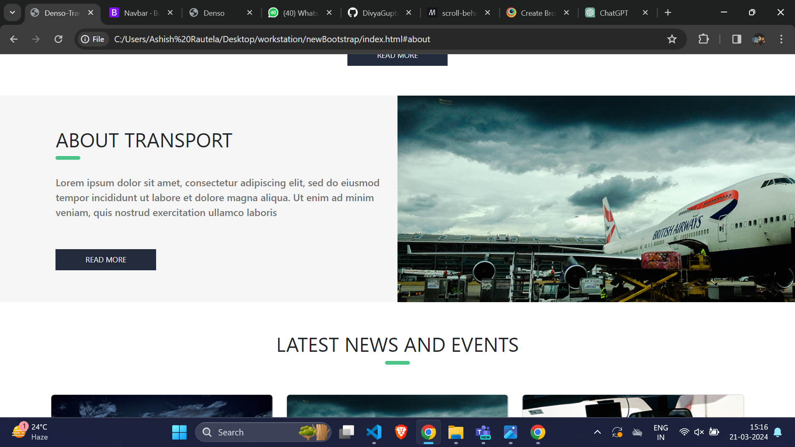
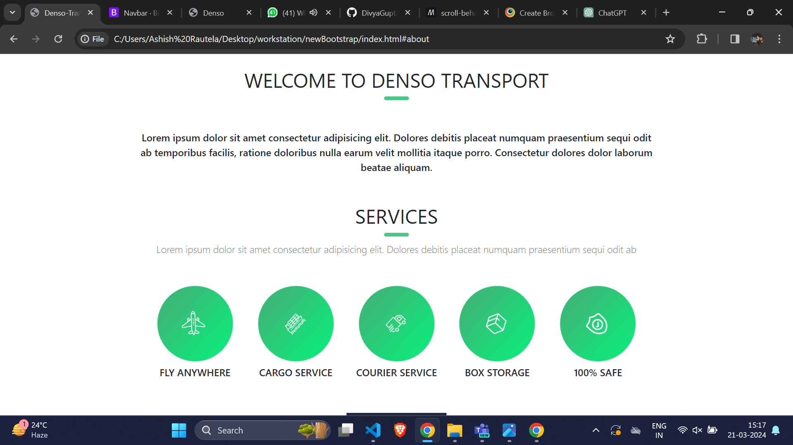
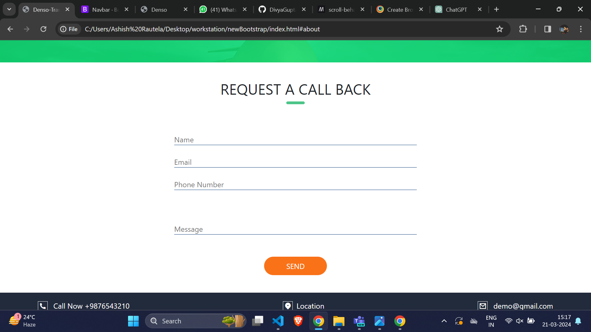

# Denso - Transportation Company Website

This project is a website template for a transportation company called 'Denso.' It includes sections such as a landing page, navigation bar, information sections, contact form, and footer.

## Overview

The 'Denso' website template is designed for a transportation company to showcase its services, news, client testimonials, and contact information. It is built using HTML, CSS, Bootstrap, and includes responsive design for various devices.

## Technologies Used

- HTML5
- CSS3
- Bootstrap 5.3.3
- JavaScript (Bootstrap JS for components)

## Features

- Responsive design for mobile, tablet, and desktop.
- Contact form for users to request callbacks.
- Latest news and events section.
- Testimonial section for client feedback.
- Footer with company information and social media links.

## Screenshots

.png)

## Setup Instructions

1. Clone the repository to your local machine.
2. Open the project folder in your code editor.
3. Modify the content in HTML and CSS files as needed.
4. Customize images, logos, and other assets in the 'public' folder.
5. Run the website locally to test responsiveness and functionality.

## Usage

1. Navigate to the landing page to explore the website.
2. Use the navigation bar to visit different sections.
3. Fill out the contact form to request a callback.
4. Read the latest news and client testimonials.

## Credits

- Bootstrap (https://getbootstrap.com/)
- Remix Icons (https://remixicon.com/)
- Font Awesome Icons (https://fontawesome.com/)

